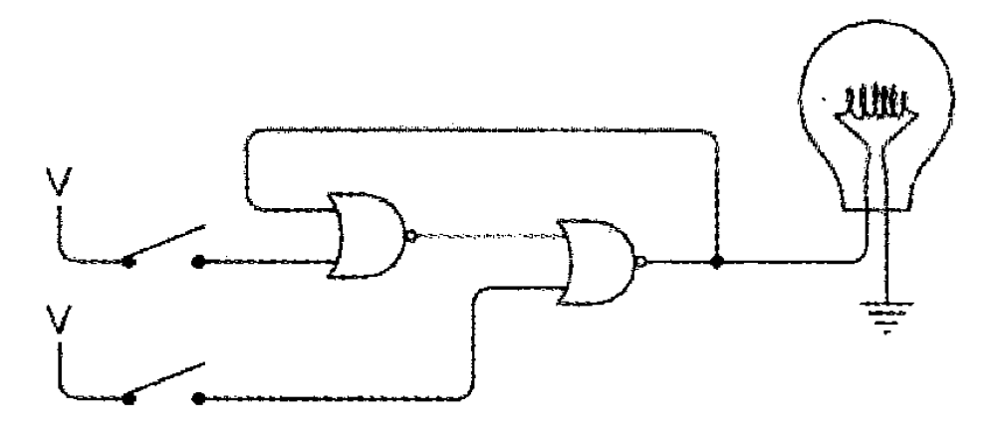

[TOC]

反向器 -> 振荡器 -> 触发器 

# 目标
首先一个问题：对我们来说，什么才是存储器？

最开始学习存储器的时候，我其实不太明白为什么需要专门实现一个“存储器”，因为我想到的是电路的状态始终都是存在的，为什么需要保存？

比如说，现在有一个电路系统，假设它有4个开关，开关闭合代表1，开关断开代表0。利用开关我们表示数据，比如全部断开表示数据0000，全部闭合表示数据1111。

事实上是有一些问题的，因为“输入”和“数据”在这里是耦合的，理论上这应该是两部分的内容。

为什么输入和数据应该被分离成两部分内容？

因为输入是会变化的部分，而数据是我们希望稳定的部分。

为了辅助理解这句话，这里我举一个例子，我们通过某些运算【比如加法运算】得到一个值1100，我们希望将这个值保存，然后使用这个值继续进行运算。这个继续运算可能是马上进行，也可能是在其他运算之后再进行的。

在这里我们发现，如果不保存数据，仅仅作为输入或输出，想要复用数据是不能的。我们可以认为，存储器的目的就在于保存稳定的数据，以便再需要的时候复用，避免重复的输入或运算。

确定了目标之后，我们思考怎么实现这个存储器。

考虑使用场景，我们认为存储器需实现以下需求：
1. 存储状态：通过输入可以设置/修改数据
2. 访问状态：数据不会被输入所影响

最终我们会实现这个需求，不过目前，让我们从基础一点点的向上实现。

# 振荡器【时钟】
振荡器的简单模型就是一个开关+反向器组成的环形回路。

这个模型的特殊之处在于
1. 输出即输入
2. 状态在不断变化
3. 状态变化是自发进行的，不需要手动干预

什么是振荡器？不需要手动干预，状态在0/1间规律切换的机器。

一些基本概念：
- 周期/循环：从某个初始状态开始，经过一段时间又回到初始状态，这段间隔被称作周期/循环
- 频率：周期的倒数，比如周期为0.05s，那么频率为`1 / 0.05 = 20hz`

振荡器有什么用？

# 反馈器
## RS触发器
首先来看一个电路：

这是由2个开关 + 2个或非门 + 1个输出组成的电路。

回顾下或非门的逻辑表：
| NOR | 0 | 1|
|--|--|--|
|0 | 1 | 0|
|1 | 0 | 0|

根据这个逻辑表，我们对电路进行操作，演示可能的5种情况：
1. 初始状态。此时左边的或非门输出是0+0=>1，右边或非门输出结果是1+0=>0，最终输出是0
2. 闭合左边的或非门，输出是1+0=>0，右边的或非门输出结果是0+0=>1，最终输出是1
3. 紧接其上，断开左边的或非门，输出是0+1=>0【**注意这里，这个1是右侧或非门的输出**】，右边的或非门输出是0+0=>1，最终输出依旧是1
4. 闭合右侧的或非门，右边的或非门输出是1+X=>0，左侧输出是0+0=>1，最终输出是0
5. 紧接其上，断开右边的或非门，右侧输出是0+1=>0，左侧输出是0+0=>1，最终输出是0

这个电路的组成特殊之处在于：左边的或非门输出是右边的或非门输入，右边的或非门输出是左边的或非门输入，这种连接方式我们称之为**反馈**【关键在于输出会被返回为输入】

下面观察现象：
1. 闭合上面的开关，再断开，灯泡发光
2. 闭合下面的开关，再断开，灯泡不发光

电路表现上的奇怪之处在于：在开关都断开的情况下，灯泡有时发光有时不发光。两个开关都断开时，电路有两种稳定的状态，这种电路我们统称为**触发器**

我们用一张表来表示电路的输入输出情况：
| S | R | Q | Q反 |
| -- | -- | -- | -- |
| 1 | 0 | 1 | 0 |
| 0 | 1 | 0 | 1 |
| 0 | 0 | Q | Q反 |
| 1 | 1 | 禁止 | 禁止 |

特别说明下当S、R均为1时，此时Q、Q反均为0，违反了两者相反的定义，因而设计时需要避免此类情况的出现。

对于RS触发器而言，最显著的特点就是：通过当前状态我们可以知道上一次是S输入或R输入。

利用RS触发器的特点，我们可以进一步构造出我们所需要的存储器。首先回顾下，我们所希望的存储器行为是怎样的？

存储器电路存在两个输入端，一个输入是数据，另一个是保持位，数据可以输入0/1，保持位为0时，数据输入不会对电路系统造成影响；保持位为1时，数据输入会被电路系统记住。

## D型触发器
我们的RS触发器的基础上进一步构造，我们加上一个保持位开关，并将其与R、S给自连接到一个与非门中